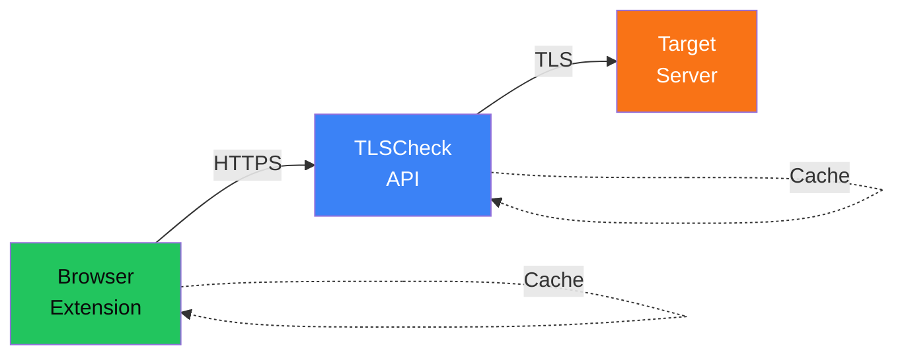
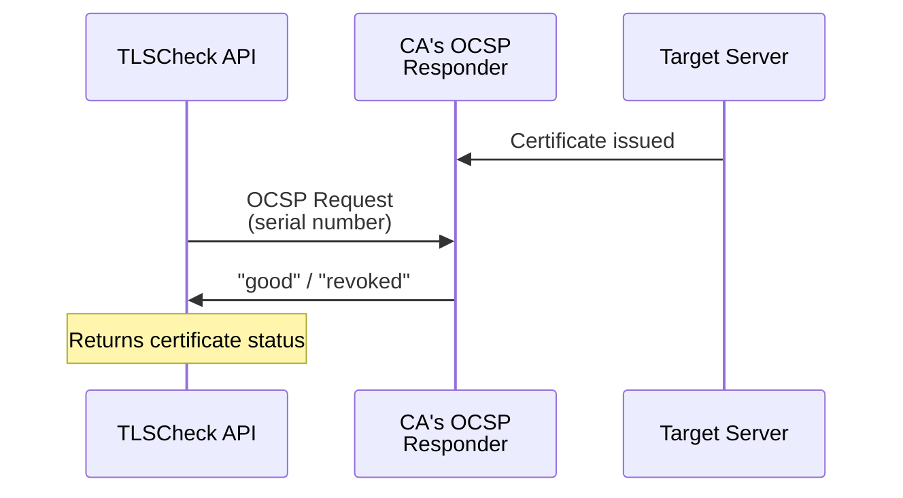
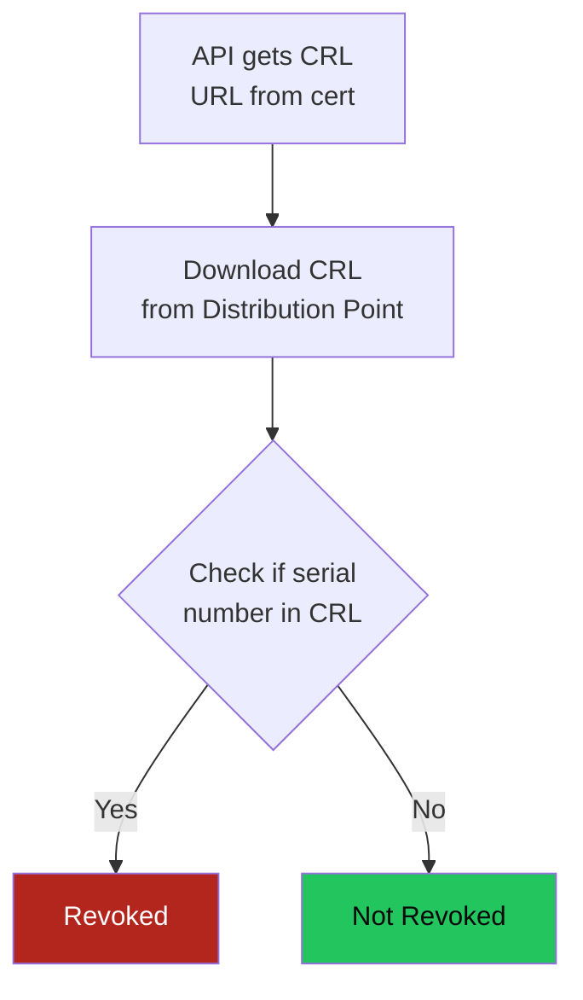
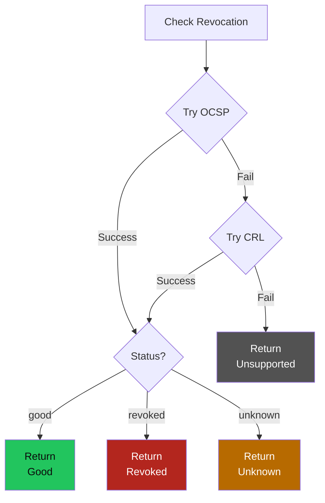

## Overview

TLSCheck consists of two main components:

1. **Chrome Extension** - Checks TLS certificates for every HTTPS page you visit
2. **API Backend** - Performs the actual TLS certificate analysis including revocation checks

## Traffic Flow

### Step-by-Step Flow

1. **User visits HTTPS page** → Extension detects the URL
2. **Extension checks local cache** → If cached, use cached result
3. **If not cached** → Send hostname to configured API endpoint
4. **API connects to target server** → Performs TLS handshake
5. **API retrieves certificate chain** → Gets all certificates in chain
6. **API checks revocation** → Queries OCSP or CRL for each certificate
7. **API returns result** → Includes validity, protocol, cipher, revocation status
8. **Extension displays result** → Shows badge (✓/X) and details in popup

## Certificate Revocation

### What is OCSP?

**Online Certificate Status Protocol (OCSP)** is a real-time protocol to check if a certificate has been revoked.

**How OCSP works:**
1. Certificate contains URL of CA's OCSP responder
2. API sends request to OCSP responder with certificate serial number
3. OCSP responder returns "good", "revoked", or "unknown"
4. If revoked, includes reason (e.g., "keyCompromise", "caCompromise")

### What is CRL?

**Certificate Revocation List (CRL)** is a list of revoked certificates published by CAs.

**How CRL works:**
1. Certificate contains URL(s) of CRL distribution points
2. API downloads the latest CRL from the distribution point
3. API checks if the certificate's serial number is in the CRL
4. If found, the certificate is revoked

## TLSCheck API Priority

TLSCheck checks revocation in this order:

1. **OCSP** - Try first (faster, real-time)
2. **CRL** - Fallback if OCSP fails or is unavailable
3. **Good** - If neither OCSP nor CRL indicates revocation

This ensures maximum coverage - even if one method fails, the other may succeed.

## Cache Strategy

To minimize API load and improve response times:

- Results are cached locally in the extension (memory)
- API results are cached for configurable time (default: 30 minutes)
- Cache key includes revocation check flag

## Security Considerations

- All communication between extension and API uses HTTPS
- API connects to target servers using proper TLS validation
- Revocation checks help detect compromised certificates
- No sensitive data is stored or logged
